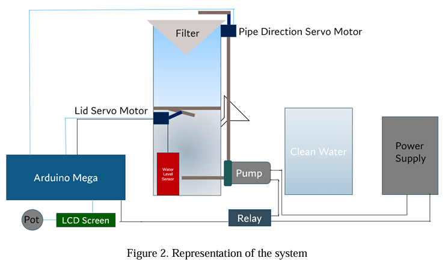
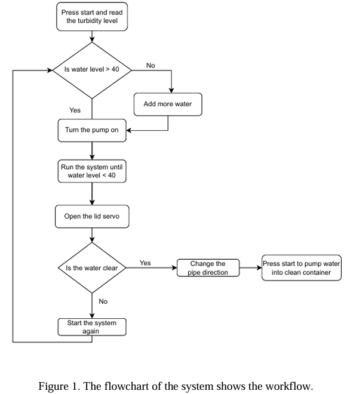
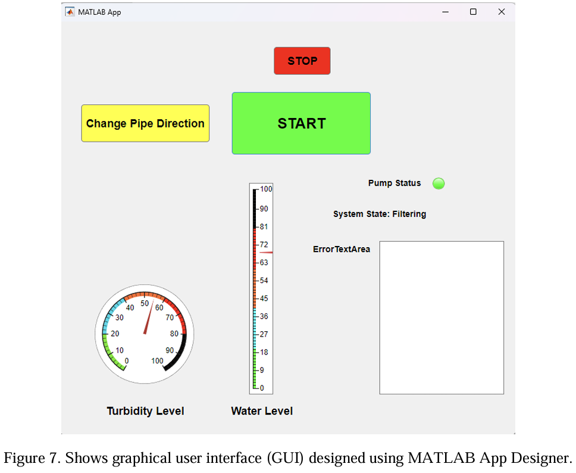

# Automated Water Filtration System with MATLAB GUI

## Project Overview
I developed an automated water filtration system designed to purify polluted water efficiently without manual supervision. I programmed the system to continuously monitor the water level and control a peristaltic pump alongside servo motors to manage the entire filtration cycle. To provide real-time monitoring and remote control capabilities, I built a custom MATLAB Graphical User Interface (GUI) that communicates directly with the hardware via serial communication.

## System Design
The physical architecture of the system consists of a main filtration container, a clean water reservoir, a peristaltic pump, and multiple servo motors. I used an Arduino Mega as the central processing unit to interface with the water level sensor and manage the actuators via a relay module.

## System Workflow
The logic of the automation is driven by continuous parameter assessment. The system checks the water level to ensure safe pump operation, runs the filtration cycle, and utilizes servo motors to evaluate and redirect the clean water into a separate container once the process is complete.

## Core Features
* **Autonomous Operation:** I integrated an analog water level sensor to automatically trigger the filtration process when needed and stop the pump safely when the water level is too low.
* **Smart Water Routing:** I utilized two servo motors within the mechanical design. One controls the filter container's lid, and I programmed the other to adjust the pipe direction to route the purified water into a separate clean container once the filtration is complete.
* **Real-Time MATLAB GUI:** I designed the control interface using MATLAB App Designer to display real-time water levels, turbidity estimates, and pump status. I also added manual override functionalities that allow users to start/stop the pump and change the pipe direction remotely.
* **Robust Serial Communication:** I established a bidirectional serial communication protocol between the Arduino Mega and MATLAB at a 38400 baud rate. This handles continuous system state updates and error logging, such as preventing the pump from starting if the water level drops below the safe threshold.

## Graphical User Interface
I developed the `.mlapp` to act as the master control hub. I implemented a fixed-rate timer to parse incoming serial data every 0.1 seconds, which dynamically updates the linear and circular gauges, as well as color-coded status lamps based on the hardware's real-time state.

## Hardware Components
* **Microcontroller:** Arduino Mega 2560
* **Pump:** Peristaltic Dosing Pump (controlled via a Relay module)
* **Actuators:** 2x SG90 RC Servo Motors (for Lid and Pipe direction control)
* **Sensors:** Analog Water Level Sensor
* **Display:** 16x2 LCD Screen with potentiometer for local status monitoring

## Software Architecture
* **Arduino (C++):** I wrote the firmware to handle sensor data acquisition, servo positioning, relay control, and local LCD updates. The logic continuously listens for incoming serial commands (`START`, `STOP`, `CHANGE`) and broadcasts the system status (`Water Level: X`, `PUMP:ON`, `ERROR:Low Water`).
* **MATLAB:** Handles the visual feedback and sends user-initiated override commands to the microcontroller reliably.
